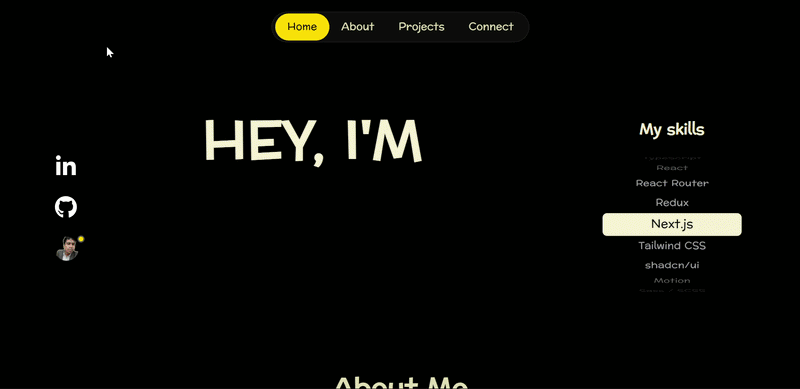
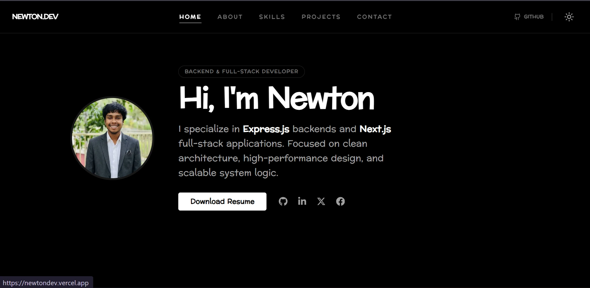
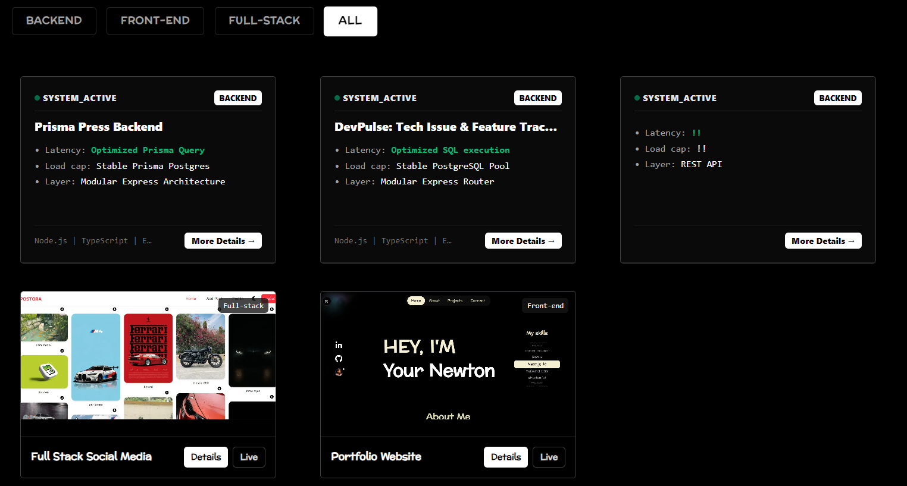
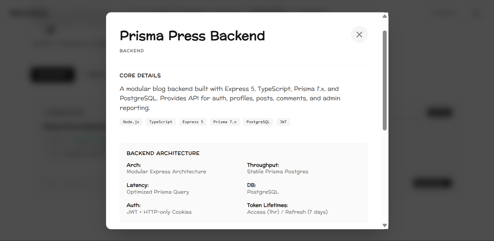
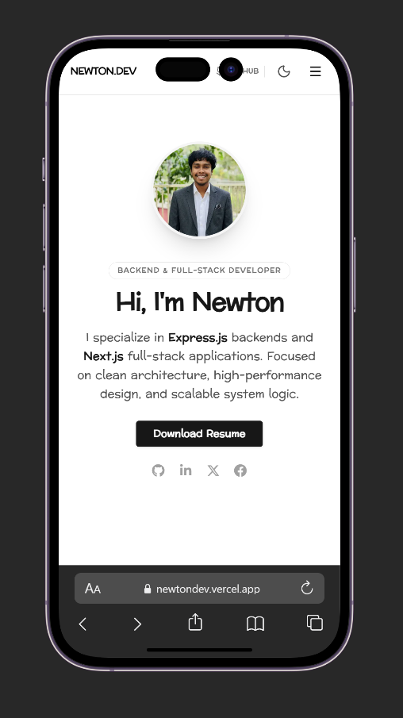
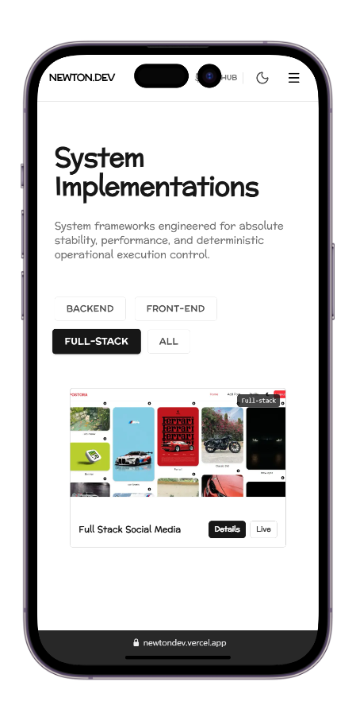

# 🚀 Newton Developer Portfolio

A modern **frontend developer portfolio** built with **Next.js, React, TypeScript, and Tailwind CSS**.

Showcasing my projects, UI experiments, and development journey.

### 🌐 Live Demo
https://newtondev.vercel.app/

---

# 🎥 Demo

---

# 📌 Badges

---

# 📸 Preview

## Desktop

---

## Mobile

---

# 📚 Table of Contents

- About
- Features
- Tech Stack
- Project Structure
- Installation
- Deployment
- Future Improvements
- Author

---

# 🧠 About

This is my **personal portfolio website** where I showcase:

- Frontend development skills
- Personal projects
- UI and animation experiments
- Contact information

The goal is to present my work in a **clean, modern, and responsive interface**.

---

# ✨ Features

✔ Responsive design  
✔ Modern UI with Tailwind CSS  
✔ Interactive cursor animation  
✔ Smooth scrolling animations  
✔ Project showcase section  
✔ Mobile-first layout  
✔ Optimized performance with Next.js  

portfolio/
├── public/
│
├── src/
│   ├── app/
│   │   ├── (routes)/
│   │   │   ├── about/
│   │   │   ├── connect/
│   │   │   └── projects/
│   │   │
│   │   ├── favicon.ico
│   │   ├── globals.css
│   │   ├── layout.tsx
│   │   └── page.tsx
│   │
│   ├── components/
│   │   ├── AboutPage/
│   │   ├── AllPage/
│   │   ├── ConnectPage/
│   │   ├── ProjectPage/
│   │   ├── effects/
│   │   ├── layout/
│   │   └── ui/
│   │
│   └── lib/
│       └── utils.ts
│
├── .gitignore
├── components.json
├── eslint.config.mjs
├── next.config.ts
├── package.json
├── package-lock.json
├── postcss.config.mjs
├── tsconfig.json
└── README.md

# ⚙️ Installation

Clone the repository
git clone https://github.com/Newton2n/portfolio.git

Navigate to the folder

cd portfolio

Install dependencies
npm install

Run development server
npm run dev

Open

http://localhost:3000

---

# 🚀 Deployment

This project is deployed using **Vercel**.

Steps:

1. Fork repository  
2. Import project in Vercel  
3. Connect GitHub  
4. Deploy  

---

# 📈 Future Improvements

- Blog section   
- Dark / Light theme  
- More animations  
- Performance improvements  

---

# 👨‍💻 Author

**Newton**

🌐 Portfolio  
https://newtondev.vercel.app/

💻 GitHub  
https://github.com/Newton2n

---

# ⭐ Support

If you like this project, please give it a **star ⭐ on GitHub**.
